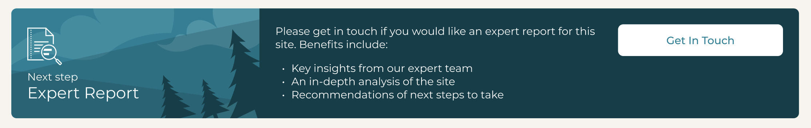

# Cultivo - take home programming assignment

## Instructions

The task is to build a responsive banner / card. The design is available in Figma [here](https://www.figma.com/file/HrbZ3oB1inqZuAi9VVdQb4/CTA-Banner?type=design&node-id=1%3A9&mode=design&t=wNbdC14RMG5QaNSk-1). If you cannot access this then please ask your Cultivo contact ASAP - you cannot complete the assignment without the design.



1. Use the GitHub button `Use this template` > `Create a new repository` to create a copy of this repository in own GitHub account.
2. Implement the component and include it in `app/page.tsx`
3. Commit and push all changes to your fork.
4. Reply by email to your Cultivo contact person:
  * Include a link to your forked repository
  * No need to implement this, but please explain in as much detail as possible how we could extend the solution so that:
    * we send a Slack message to the team for the customer message
    * instead of using local storage to keep track of whether the form was submitted we keep track of that server-side, so that the appropriate banner state is displayed no matter which device the user logs into

#### Development notes
* Implement this responsive banner as a TypeScript React component. **Code quality** and **pixel perfect execution** are equally important.
* When the button is clicked display the `ContactFormDialog` component provided.
* It may be relevant to know that this is just one of many possible banners on the platform - they would all follow the same style but use different text, imagery and button action.

## Getting Started

First, install dependencies:
```bash
npm install
```

Next, run the development server:

```bash
npm run dev
# or
yarn dev
# or
pnpm dev
# or
bun dev
```

Open [http://localhost:3000](http://localhost:3000) with your browser to see the result.

You can start editing the page by modifying `app/page.tsx`. The page auto-updates as you edit the file.

## Learn More

This is a [Next.js](https://nextjs.org/) project bootstrapped with [`create-next-app`](https://github.com/vercel/next.js/tree/canary/packages/create-next-app).

To learn more about Next.js, take a look at the following resources:

- [Next.js Documentation](https://nextjs.org/docs) - learn about Next.js features and API.
- [Learn Next.js](https://nextjs.org/learn) - an interactive Next.js tutorial.

You can check out [the Next.js GitHub repository](https://github.com/vercel/next.js/) - your feedback and contributions are welcome!

## Deploy on Vercel

The easiest way to deploy your Next.js app is to use the [Vercel Platform](https://vercel.com/new?utm_medium=default-template&filter=next.js&utm_source=create-next-app&utm_campaign=create-next-app-readme) from the creators of Next.js.

Check out our [Next.js deployment documentation](https://nextjs.org/docs/deployment) for more details.
